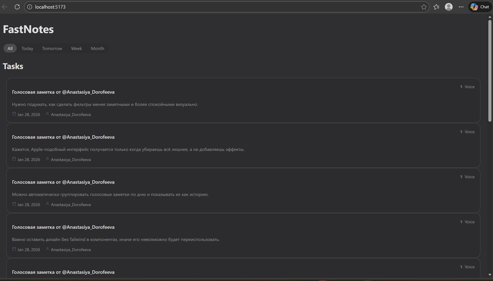
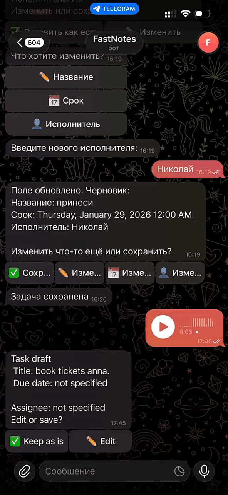

# FastNotes

Voice-first task manager that turns Telegram voice messages into structured tasks and syncs them to a web UI. It combines a Telegram bot, OpenAI Whisper transcription, and a .NET API with a lightweight React frontend.

## Problem & Goal
Many people capture tasks on the go but lose them due to friction: typing, switching apps, or forgetting to log the task later. FastNotes aims to reduce that friction by letting users send a voice message in Telegram, confirm the parsed task, and immediately see it in a web dashboard.

## Key Features
- **Voice to tasks**: Telegram voice messages are transcribed with Whisper and parsed into task drafts.
- **Interactive draft confirmation**: Users can edit the title, due date, or assignee before saving.
- **Web UI**: Tasks are visible in a clean dashboard with filters.
- **Dockerized stack**: API, UI, and Postgres can run together via `docker-compose`.

## Tech Stack
- **Backend**: .NET 8, ASP.NET Core, EF Core, PostgreSQL
- **Integrations**: Telegram Bot API, OpenAI Whisper
- **Frontend**: React + Vite + TypeScript
- **DevOps**: Docker, docker-compose

## Architecture Overview
```
fastnotes-ui/          # React frontend (Vite)
FastNotes.Api/         # ASP.NET Core API + Telegram bot
FastNotes.Shared/      # Shared contracts (DTOs)
FastNotes.Tests/       # Unit tests
docker/                # Dockerfiles + docker-compose
```
See [docs/architecture.md](docs/architecture.md) for C4 and sequence diagrams.

### Request Flow (happy path)
1. User sends a voice message to the Telegram bot.
2. Bot downloads the audio and sends it to Whisper for transcription.
3. A draft task is created from the parsed transcript.
4. User confirms or edits the draft.
5. Task is saved in Postgres and appears in the web UI.

## Local Setup

### 1) Prerequisites
- .NET 8 SDK
- Node.js 18+
- Docker (optional but recommended)

### 2) Configure secrets
Copy the example config and add your keys:
```
cp FastNotes/appsettings.json FastNotes/appsettings.Local.json
```
Then update:
- `TelegramBot:Token`
- `OpenAI:ApiKey`
- `DatabaseSettings:ConnectionString`

> Note: `appsettings.Local.json` is not checked into git. You can also use environment variables or user secrets.

### 3) Run with Docker (recommended)
```
docker compose -f docker/docker-compose.yml up --build
```
Then open:
- UI: http://localhost:3000
- API: http://localhost:5000/swagger

### 4) Run locally (without Docker)
Start Postgres, then run:
```
dotnet run --project FastNotes.Api
cd fastnotes-ui
npm install
npm run dev
```

## API
- Swagger is enabled at `/swagger`.
- Main endpoint: `GET /api/tasks`

## Interesting Engineering Details
- Natural language parsing for due dates and assignees from transcribed text.
- Telegram callback workflows for editing drafts.
- Separation between EF Core entities (`TaskItem`) and DTOs (`TaskDto`).

## Roadmap Ideas
- Authentication (JWT)
- Background queue for transcription
- More advanced filtering/search
- CI pipeline for tests

## Demo


<p align="center">

</p>
