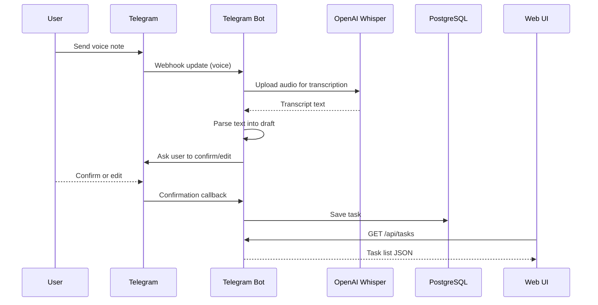

# Architecture

This document provides a short overview of the architecture and a minimal sequence flow.

## Overview (simple)

- **Telegram Bot (ASP.NET Core)** receives voice notes and drives the draft confirmation flow.
- **API (ASP.NET Core)** handles task management and transcription orchestration.
- **PostgreSQL** stores tasks and metadata.
- **Web UI (React)** displays tasks and filters.
- **External services**: Telegram Bot API and OpenAI Whisper.
## Sequence (happy path)

